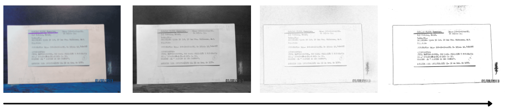
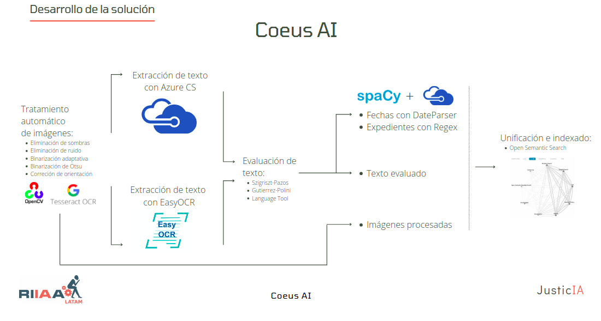
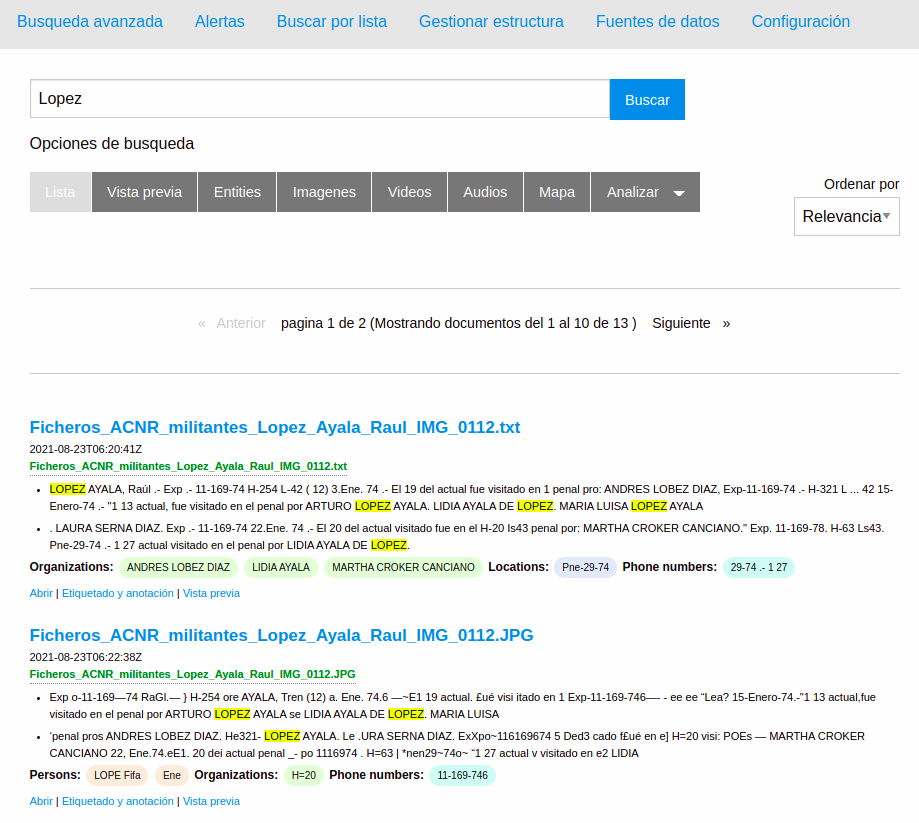

# Hackathon RIIAA 2021 "JusticIA para los desaparecidos"
# Coeus AI

**Nombre del equipo**  
Coeus AI

**Integrantes**
* Gallardo García Rafael
* Herrera Maldonado Ángel
* Olivares López Jessica
* Remigio Alvarado Alberto

## Descripción
Coeus AI es un sistema robusto y flexible para el análisis inteligente de documentos. Las funcionalidades incluyen:
- Tratamiento de imágenes
- Extracción de texto
- Un motor de búsqueda semántico capaz de comprender consultas en lenguaje natural y retornar los documentos más adecuados.

## Pipeline
A continuación se describen de forma general los flujos de trabajo realizados por Coeus AI. Si se desea información detallada, es posible consultar
los comentarios en las libretas correspondientes.

### Cómo utilizar Coeus AI: Selección de técnica de pre-procesamiento de documentos
1. Se generó un conjunto de prueba aislado, de modo que los textos generados con OCR pudieran ser comparados con los anotados manualmente,
2. La evaluación se realizó con las métricas de similitud de Dice, Jaccard y Coseno,
3. La mejor técnica de pre-procesamiento se estableció por defecto dentro de los siguientes pasos,
4. Todo el procedimiento y las pruebas de concepto del proceso aquí descrito se pueden encontrar en la libreta [Preprocesamiento](Preprocesamiento.ipynb),
5. Un ejemplo del flujo de pre-procesamiento se puede encontrar en la .

### Cómo utilizar Coeus AI: Flujo de datos general
1. El código, las descripciones, así como el pipiline general de este paso están disponibles en la libreta [CoeusAI-Principal](CoeusAI-Principal.ipynb)
2. La libreta [CoeusAI-Principal.ipynb](CoeusAI-Principal.ipynb) se puede ejecutar haciendo uso de Jupyter Notebooks o JupyterLab.
3. Un ejemplo del flujo general se puede encontrar en la .

### Cómo utilizar Coeus AI: Motor de búsqueda semántico.
1. El servicio de búsqueda semántico basado en Open Semantic Search está disponible en: http://coeus-ai.ddns.net/search/
2. El servicio necesita de afinaciones para ser completamente funcional, es decir, el servicio se presenta únicamente como un Producto Mínimo Viable,
3. El software de Open Semantic Search es de código abierto. Por lo tanto, nuestra configuración específica para el español, así como nuestra traducción
de la interfaz gráfica también serán de código abierto. Sin embargo, es trabajo futuro,
4. Un ejemplo del motor de búsqueda se puede encontrar en la .
